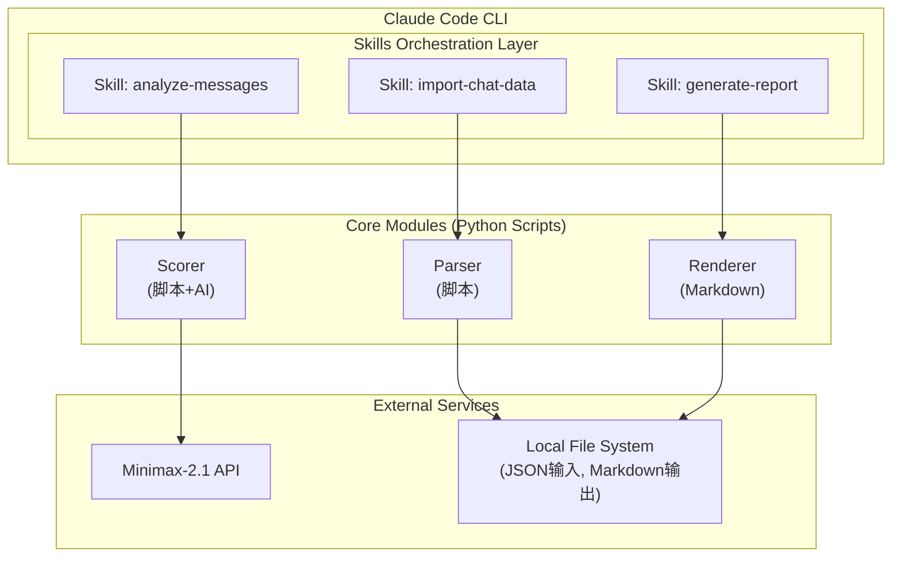
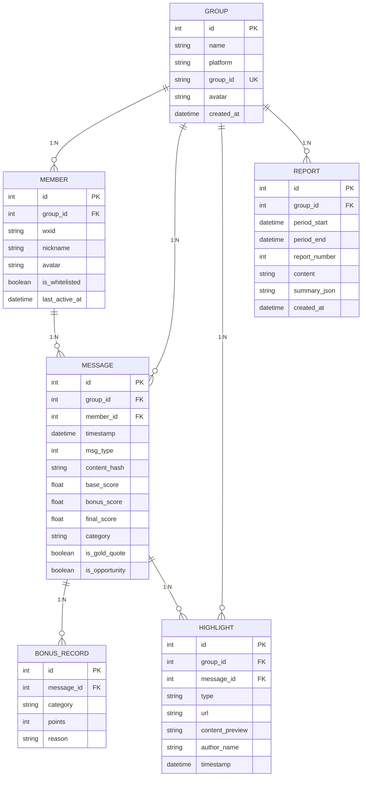
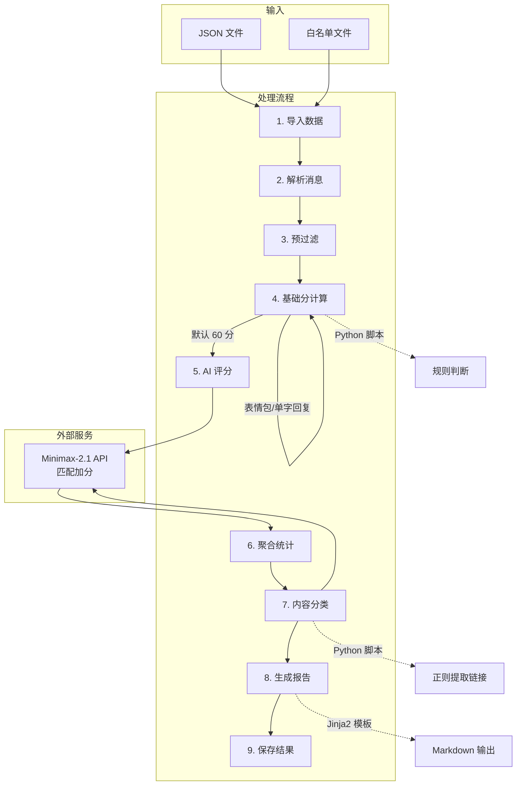

# 系分文档: 群聊记录分析工具 (Agent Skills 方案)

## 关联文档

| 文档 | 路径 |
|------|------|
| PRD | [PRD.md](docs/产品/PRD/PRD.md) |
| BRD | [BRD_业务需求文档.md](docs/产品/BRD/BRD_业务需求文档.md) |
| 技术选型 | [技术选型报告.md](docs/技术选型报告.md) |

---

## 1. 需求理解

### 1.1 核心需求概述

基于 PRD，本工具需要实现以下核心功能：

| 功能模块 | 核心需求 | 优先级 |
|----------|----------|--------|
| 数据采集 | 导入 JSON 格式月度聊天记录，解析成员/消息结构 | P0 |
| AI 评分 | 初始分 60 + AI 匹配加分，4维度评估 | P0 |
| 精彩内容提取 | 链接识别、金句判定、机会分享识别 | P0 |
| 报告生成 | Markdown 文档输出（含排行榜、精彩内容、低质名单） | P0 |
| 辅助决策 | 提醒文本生成、清退名单生成 | P1 |

### 1.2 技术目标

1. **数据处理**：支持 JSON 格式导入，月度消息量级（预估 < 5000 条）
2. **评分效率**：月度消息 AI 评分耗时 < 30秒
3. **评分准确率**：低质成员判定准确率 > 90%
4. **输出格式**：仅生成 Markdown 文档

### 1.3 技术约束

| 约束项 | 说明 |
|--------|------|
| 运行方式 | Claude Code Agent，通过 Skills 调用 |
| AI 模型 | 仅限使用已配置的 Minimax-2.1 (默认) 或 GLM-4.7 (备选) |
| 数据存储 | 数据仅本地处理，不上云 |
| 数据格式 | 仅支持 JSON（来自月度导出） |

### 1.4 白名单机制

**输入格式**：支持简单的文本列表（PRD 要求）

```text
# Top3 活跃成员
张三
李四
王五

# 贡献成员
赵六
钱七
```

**豁免规则**：
- 白名单成员不参与低质判定
- 但参与活跃度排名
- 支持 `#` 注释和空行

### 1.5 低质成员判定逻辑

| 判定类型 | 条件 | 严重程度 |
|----------|------|----------|
| **零发言** | 周期内无任何有效消息 | 高 |
| **低质量** | 平均分 < 60分 | 中 |
| **低频次** | 发言数 < 5条 | 低 |

**排序规则**：按严重程度降序排列（零发言 → 低质量 → 低频次）

---

## 2. Agent Skills 架构设计

### 2.1 整体架构



### 2.2 Skills 定义

#### Skill 1: import-chat-data (数据采集)

**职责**：导入并解析月度群聊记录 JSON 文件

**输入参数**：
```typescript
interface ImportInput {
  filePath: string;      // JSON 文件路径（必需）
  config?: {
    whitelistPath?: string;   // 白名单文件路径（可选）
    startDate?: string;       // 统计开始时间 ISO 8601（可选）
    endDate?: string;         // 统计结束时间 ISO 8601（可选）
  };
}
```

**实现方式**：
| 任务 | 实现方式 | 说明 |
|------|----------|------|
| JSON 解析 | Python 脚本 (json 标准库) | 解析 WeFlow 导出的 JSON |
| 时间戳转换 | Python 脚本 | Unix timestamp → datetime |
| 白名单解析 | Python 脚本 | 解析 `#` 注释格式的 TXT 文件 |

**输出**：
```typescript
interface ImportOutput {
  success: boolean;
  data?: {
    groupInfo: GroupInfo;
    messages: ParsedMessage[];
    members: Member[];
    whitelist: string[];       // 白名单成员昵称列表
    statistics: ImportStatistics;
  };
  error?: {
    code: string;
    message: string;
  };
}

interface ImportStatistics {
  totalMessages: number;
  validMessages: number;
  filteredMessages: number;
  totalMembers: number;
  whitelistedMembers: number;
}
```

---

#### Skill 2: analyze-messages (AI 分析)

**职责**：消息评分、内容分类

**输入参数**：
```typescript
interface AnalyzeInput {
  messages: ParsedMessage[];    // 待评分消息
  whitelist: string[];         // 白名单成员昵称列表
  config?: {
    scoringModel?: "minimax-2.1" | "glm-4.7";  // 默认 minimax-2.1
    batchSize?: number;                          // AI 批处理大小，默认 20
    lowQualityThreshold?: number;                 // 低质判定阈值，默认 60
    minMessageCount?: number;                    // 低频次阈值，默认 5
  };
}
```

**实现方式**：
| 任务 | 实现方式 | 说明 |
|------|----------|------|
| 消息预过滤 | Python 脚本 | 过滤系统消息(type=80)、空消息 |
| **AI 评分** | **Minimax-2.1** | 匹配加分机制（初始 60 + 加分项） |
| **内容分类** | **Minimax-2.1** | 链接类型识别、金句判定、机会识别 |
| 低质判定 | Python 脚本 | 零发言 / 平均分 < 阈值 / 发言数 < 阈值 |

**AI 评分 Prompt（匹配加分机制）**：

```markdown
## 角色
你是一个群聊内容质量评估专家，负责对群成员的消息进行评分。

## 评分规则
**初始分**: 60 分（每条消息的起点）

**加分项**（满足条件则加分，可叠加）:

| 加分类别 | 加分分值 | 条件说明 |
|----------|----------|----------|
| 技术分享 | +15~25 | 分享技术文章、教程、代码片段、解决方案 |
| 资源分享 | +10~20 | 分享有价值的工具、链接、资料 |
| 解答问题 | +10~15 | 回答他人问题，提供有效帮助 |
| 深度讨论 | +10~20 | 参与技术讨论，提出独到见解 |
| 原创观点 | +10~15 | 输出个人原创思考或经验总结 |
| 机会分享 | +10~15 | 分享招聘、合作、实习等信息 |
| 互动回复 | +5~10 | 对他人消息进行有价值的回复 |

**扣分项**（直接重置为低分或 0 分）:

| 扣分类别 | 分值 | 条件说明 |
|----------|------|----------|
| 纯表情包 | 0分 | 仅发送表情包，无文字内容 |
| 单字回复 | 0分 | "嗯"、"好"、"1"、"ok" 等无意义回复 |
| 刷屏重复 | 0分 | 短时间内重复发送相同内容 |
| 水群无意义 | 0~20分 | "来了"、"签到"、"打卡" 等无营养内容 |

## 任务
对以下消息进行评分，判断符合哪些加分/扣分条件。

## 输出格式
```
{
  "base_score": 60,
  "bonus_items": [
    {"category": "技术分享", "points": 20, "reason": "分享了 Vue 3 教程链接"}
  ],
  "deduction_items": [],
  "final_score": 80,
  "is_gold_quote": false,
  "is_opportunity": false,
  "category": "tech_article|github|insight|opportunity|other"
}
```

## 特殊说明
- 只返回 JSON，不要有其他内容
- 不要调用任何工具
- 加分分值在同一类别内有浮动范围，根据内容质量浮动

**输出**：
```typescript
interface AnalyzeOutput {
  success: boolean;
  data?: {
    memberScores: MemberScore[];     // 每个成员的评分统计
    highlights: Highlight[];         // 精彩内容列表
    lowQualityMembers: LowQualityMember[];  // 低质成员名单
  };
  error?: {
    code: string;
    message: string;
  };
}

interface MemberScore {
  wxid: string;
  nickname: string;
  messageCount: number;
  totalScore: number;
  averageScore: number;
  isWhitelisted: boolean;
  status: "normal" | "low_quality" | "zero_activity" | "low_frequency";
  reason?: string;  // 低质原因
}

interface LowQualityMember {
  wxid: string;
  nickname: string;
  messageCount: number;
  averageScore: number;
  status: "zero_activity" | "low_quality" | "low_frequency";
  severity: "high" | "medium" | "low";  // 严重程度
}

interface Highlight {
  type: "article" | "github" | "insight" | "opportunity";
  url?: string;
  content?: string;
  author: string;
  timestamp: Date;
}
```

---

#### Skill 3: generate-report (报告生成)

**职责**：生成 Markdown 格式报告

**输入参数**：
```typescript
interface ReportInput {
  groupInfo: GroupInfo;
  memberScores: MemberScore[];
  highlights: Highlight[];
  lowQualityMembers: LowQualityMember[];
  config?: {
    period?: { start: string; end: string; };
    outputPath?: string;   // Markdown 文件路径（可选，不指定则返回内容）
    reportNumber?: number; // 报告期号，默认 1
  };
}
```

**输出**：
```typescript
interface ReportOutput {
  success: boolean;
  data?: {
    content: string;      // Markdown 内容
    filePath?: string;     // 输出文件路径（如果已保存）
    summary: {
      totalMembers: number;
      activeMembers: number;
      lowQualityCount: number;
      highlightsCount: number;
    };
  };
  error?: {
    code: string;
    message: string;
  };
}
```

**实现方式**：
| 任务 | 实现方式 | 说明 |
|------|----------|------|
| 活跃度排行 | Python 脚本 | 按发言数排序，取 Top10 |
| 精彩内容格式化 | Python 脚本 | 分类整理，按时间倒序 |
| 低质名单整理 | Python 脚本 | 按严重程度排序 |
| **Markdown 生成** | **Python 脚本 + Jinja2** | 输出 .md 文件 |

**Markdown 报告模板**（Jinja2 语法）：

```markdown
# 📊 群聊周期报告 - {{ group_name }}

**统计周期**: {{ period_start }} ~ {{ period_end }}
**生成时间**: {{ generated_at }}
**报告期号**: 第 {{ report_number }} 期

---

## 📈 数据概览

| 指标 | 数值 |
|------|------|
| 总成员数 | {{ total_members }} |
| 活跃成员数 | {{ active_members }} |
| 低质成员数 | {{ low_quality_count }} |
| 精彩内容数 | {{ highlights_count }} |

---

## 🏆 活跃度排行榜 (Top10)

| 排名 | 成员 | 发言数 | 平均分 |
|------|------|--------|--------|

| {{ loop.index }} | {{ member.name }} | {{ member.msg_count }} | {{ "%.1f"|format(member.avg_score) }} |


---

## ✨ 本期精彩内容

### 📚 公众号/技术文章

- [{{ item.title }}]({{ item.url }}) @{{ item.author }}

- 暂无


### 💻 Github 项目

- [{{ item.repo }}]({{ item.url }}) @{{ item.author }}

- 暂无


### 💡 原创见解

- "{{ item.content }}" — @{{ item.author }}

- 暂无


### 🎯 机会分享

- {{ item.summary }} — @{{ item.author }}

- 暂无


---

## ⚠️ 低质成员名单


### {{ loop.index }}. {{ member.name }}
- **发言数**: {{ member.msg_count }}
- **平均分**: {{ "%.1f"|format(member.avg_score) }}
- **原因**: {{ member.reason }}
- **严重程度**: {{ member.severity_emoji }}

---

- 本期无低质成员


## 📝 附录

### 低质判定规则
- **零发言**: 周期内无任何有效消息
- **低质量**: 平均分 < 60 分
- **低频次**: 发言数 < 5 条

---
*报告由群聊分析工具自动生成*
```

---

## 3. 数据模型设计

### 3.1 ER 图



### 3.2 数据库 Schema (SQLite)

```sql
-- 群组信息表
CREATE TABLE groups (
    id INTEGER PRIMARY KEY AUTOINCREMENT,
    name TEXT NOT NULL,
    platform TEXT DEFAULT 'wechat',
    group_id TEXT UNIQUE NOT NULL,
    avatar TEXT,
    created_at DATETIME DEFAULT CURRENT_TIMESTAMP
);

-- 成员信息表
CREATE TABLE members (
    id INTEGER PRIMARY KEY AUTOINCREMENT,
    group_id INTEGER NOT NULL,
    wxid TEXT NOT NULL,
    nickname TEXT NOT NULL,
    avatar TEXT,
    is_whitelisted BOOLEAN DEFAULT 0,
    last_active_at DATETIME,
    FOREIGN KEY (group_id) REFERENCES groups(id),
    UNIQUE(group_id, wxid)
);

-- 消息表（评分后脱敏，只保留统计信息）
CREATE TABLE messages (
    id INTEGER PRIMARY KEY AUTOINCREMENT,
    group_id INTEGER NOT NULL,
    member_id INTEGER NOT NULL,
    timestamp DATETIME NOT NULL,
    msg_type INTEGER DEFAULT 0,
    content_hash TEXT,
    base_score REAL DEFAULT 60,
    bonus_score REAL DEFAULT 0,
    final_score REAL,
    category TEXT,
    is_gold_quote BOOLEAN DEFAULT 0,
    is_opportunity BOOLEAN DEFAULT 0,
    FOREIGN KEY (group_id) REFERENCES groups(id),
    FOREIGN KEY (member_id) REFERENCES members(id)
);

-- 加分记录表
CREATE TABLE bonus_records (
    id INTEGER PRIMARY KEY AUTOINCREMENT,
    message_id INTEGER NOT NULL,
    category TEXT NOT NULL,
    points INTEGER NOT NULL,
    reason TEXT,
    FOREIGN KEY (message_id) REFERENCES messages(id)
);

-- 精彩内容表
CREATE TABLE highlights (
    id INTEGER PRIMARY KEY AUTOINCREMENT,
    group_id INTEGER NOT NULL,
    message_id INTEGER NOT NULL,
    type TEXT NOT NULL,
    url TEXT,
    content_preview TEXT,
    author_name TEXT,
    timestamp DATETIME,
    FOREIGN KEY (group_id) REFERENCES groups(id),
    FOREIGN KEY (message_id) REFERENCES messages(id)
);

-- 报告表
CREATE TABLE reports (
    id INTEGER PRIMARY KEY AUTOINCREMENT,
    group_id INTEGER NOT NULL,
    period_start DATETIME NOT NULL,
    period_end DATETIME NOT NULL,
    report_number INTEGER NOT NULL,
    content TEXT NOT NULL,
    summary_json TEXT NOT NULL,
    created_at DATETIME DEFAULT CURRENT_TIMESTAMP,
    FOREIGN KEY (group_id) REFERENCES groups(id),
    UNIQUE(group_id, period_start, period_end)
);

-- 索引优化
CREATE INDEX idx_messages_group_time ON messages(group_id, timestamp);
CREATE INDEX idx_messages_member ON messages(member_id);
CREATE INDEX idx_members_wxid ON members(wxid);
CREATE INDEX idx_highlights_type ON highlights(type);
CREATE INDEX idx_reports_period ON reports(group_id, period_start, period_end);
```

### 3.3 数据结构定义 (TypeScript)

```typescript
// 群组信息
interface GroupInfo {
  name: string;
  platform: string;
  groupId: string;
  avatar: string;
}

// 成员信息
interface Member {
  id: string;
  wxid: string;
  nickname: string;
  avatar: string;
  isWhitelisted: boolean;
}

// 消息结构（原始）
interface Message {
  _type: "message";
  sender: string;
  accountName: string;
  timestamp: number;
  type: number;
  content: string;
}

// 解析后的消息
interface ParsedMessage {
  id: string;
  wxid: string;
  nickname: string;
  timestamp: Date;
  msgType: number;
  content: string;
  isSystemMessage: boolean;
}

// 评分结果
interface MessageScore {
  messageId: string;
  baseScore: number;
  bonusItems: BonusItem[];
  finalScore: number;
  category: string;
  isGoldQuote: boolean;
  isOpportunity: boolean;
}

// 加分项
interface BonusItem {
  category: string;
  points: number;
  reason: string;
}

// 成员评分统计
interface MemberScore {
  wxid: string;
  nickname: string;
  messageCount: number;
  totalScore: number;
  averageScore: number;
  isWhitelisted: boolean;
  status: "normal" | "low_quality" | "zero_activity" | "low_frequency";
  reason?: string;
}

// 精彩内容
interface Highlight {
  type: "article" | "github" | "insight" | "opportunity";
  url?: string;
  content?: string;
  author: string;
  timestamp: Date;
}

// 低质成员
interface LowQualityMember {
  wxid: string;
  nickname: string;
  messageCount: number;
  averageScore: number;
  status: "zero_activity" | "low_quality" | "low_frequency";
  severity: "high" | "medium" | "low";
  reason: string;
}

// 报告摘要
interface ReportSummary {
  totalMembers: number;
  activeMembers: number;
  lowQualityCount: number;
  highlightsCount: number;
}
```

---

## 4. 项目结构

```
WxGroupReport/
├── src/
│   ├── __init__.py
│   ├── main.py              # 入口文件
│   │
│   ├── data/
│   │   ├── __init__.py
│   │   ├── parser.py        # JSON 解析器
│   │   └── loader.py       # 数据加载器
│   │
│   ├── ai/
│   │   ├── __init__.py
│   │   ├── scorer.py       # AI 评分器
│   │   └── classifier.py    # 内容分类器
│   │
│   ├── report/
│   │   ├── __init__.py
│   │   ├── generator.py    # 报告生成器
│   │   └── templates/      # Jinja2 模板目录
│   │       └── report.md.j2
│   │
│   ├── whitelist/
│   │   ├── __init__.py
│   │   └── manager.py      # 白名单管理器
│   │
│   └── utils/
│       ├── __init__.py
│       ├── constants.py    # 常量定义
│       ├── time.py         # 时间处理工具
│       └── exceptions.py   # 异常定义
│
├── skills/                    # Skills 目录
│   ├── import-chat-data/
│   │   └── skill.yaml
│   ├── analyze-messages/
│   │   └── skill.yaml
│   └── generate-report/
│       └── skill.yaml
│
├── data/                       # 数据目录
│   └── .gitkeep
│
├── output/                     # 输出目录
│   └── .gitkeep
│
├── requirements.txt
├── config.py
├── .env.example
└── .gitignore
```

### 4.1 依赖文件

**requirements.txt**：
```text
minimax>=0.1.0          # Minimax API 客户端
jinja2>=3.1.0          # 模板引擎
python-dotenv>=1.0.0   # 环境变量
tenacity>=8.0.0        # 重试机制
pytest>=7.0.0          # 测试框架
```

**.env.example**：
```bash
# Minimax API 配置
MINIMAX_API_KEY="your-api-key-here"
MINIMAX_BASE_URL="https://api.minimax.chat/v1/text/chatcompletion_v2"
MINIMAX_MODEL="minimax-2.1"

# 可选：智谱 AI 备选
# ZHIPU_API_KEY="your-api-key-here"
# ZHIPU_BASE_URL="https://open.bigmodel.cn/api/paas/v4"
# ZHIPU_MODEL="glm-4.7"

# 路径配置
DATA_DIR="./data"
OUTPUT_DIR="./output"
```

---

## 5. 核心流程设计

### 5.1 整体处理流程



### 5.2 AI 评分批处理策略

```python
from typing import List
import json
from tenacity import retry, stop_after_attempt, wait_exponential
import logging

logger = logging.getLogger(__name__)

class ScoringError(Exception):
    """评分异常基类"""
    pass

class APITimeoutError(ScoringError):
    """API 超时"""
    pass

class APIRateLimitError(ScoringError):
    """API 限流"""
    pass

class ResponseParseError(ScoringError):
    """响应解析失败"""
    pass

def batch_messages(messages: List[ParsedMessage], batch_size: int = 20) -> List[List[ParsedMessage]]:
    """将消息分批"""
    return [messages[i:i + batch_size] for i in range(0, len(messages), batch_size)]

def build_scoring_prompt(batch: List[ParsedMessage]) -> str:
    """构建评分 Prompt"""
    prompt_parts = []

    for i, msg in enumerate(batch):
        prompt_parts.append(f"""
### 消息 {i+1}
**发言人**: {msg.nickname}
**内容**: {msg.content}
""")

    return f"""
## 任务
请对以下消息进行评分，每条消息独立判断。

{prompt_parts}

## 输出格式

```json
[
  {{"index": 1, "base_score": 60, "bonus_items": [{{"category": "技术分享", "points": 20, "reason": "..."}}], "final_score": 80, "category": "tech_article", "is_gold_quote": false, "is_opportunity": false}},
  ...
]
```
"""

@retry(
    stop=stop_after_attempt(3),
    wait=wait_exponential(multiplier=1, min=2, max=60),
    retry=retry_if_exception_type((APITimeoutError, APIRateLimitError))
)
async def call_minimax_api(prompt: str) -> dict:
    """调用 Minimax API，带重试机制"""
    import os
    from openai import OpenAI

    client = OpenAI(
        api_key=os.getenv("MINIMAX_API_KEY"),
        base_url=os.getenv("MINIMAX_BASE_URL", "https://api.minimax.chat/v1/text/chatcompletion_v2")
    )

    try:
        response = client.chat.completions.create(
            model=os.getenv("MINIMAX_MODEL", "minimax-2.1"),
            messages=[
                {"role": "system", "content": SCORING_SYSTEM_PROMPT},
                {"role": "user", "content": prompt}
            ],
            temperature=0.3,
            timeout=30.0
        )
        return json.loads(response.choices[0].message.content)

    except TimeoutError as e:
        logger.warning(f"API 超时: {e}")
        raise APITimeoutError(f"API timeout: {e}")
    except Exception as e:
        if "rate_limit" in str(e).lower():
            raise APIRateLimitError(f"Rate limit: {e}")
        raise

def parse_batch_response(response: dict, batch: List[ParsedMessage]) -> List[MessageScore]:
    """解析批量评分响应"""
    results = []
    scores_by_index = {item.get("index", i+1): item for item in response}

    for i, msg in enumerate(batch):
        score_data = scores_by_index.get(i+1, {})

        bonus_items = [
            BonusItem(
                category=item.get("category", ""),
                points=item.get("points", 0),
                reason=item.get("reason", "")
            )
            for item in score_data.get("bonus_items", [])
        ]

        results.append(MessageScore(
            messageId=msg.id,
            baseScore=score_data.get("base_score", 60),
            bonusItems=bonus_items,
            finalScore=score_data.get("final_score", 60),
            category=score_data.get("category", "other"),
            isGoldQuote=score_data.get("is_gold_quote", False),
            isOpportunity=score_data.get("is_opportunity", False)
        ))

    return results

async def score_messages(messages: List[ParsedMessage]) -> List[MessageScore]:
    """评分所有消息"""
    batches = batch_messages(messages)
    all_scores = []

    for i, batch in enumerate(batches):
        logger.info(f"评分批次 {i+1}/{len(batches)}, 共 {len(batch)} 条消息")

        prompt = build_scoring_prompt(batch)

        try:
            response = await call_minimax_api(prompt)
            scores = parse_batch_response(response, batch)
            all_scores.extend(scores)
        except ScoringError as e:
            logger.error(f"批次 {i+1} 评分失败，使用默认评分: {e}")
            # 使用默认评分：60 分，无加分
            for msg in batch:
                all_scores.append(MessageScore(
                    messageId=msg.id,
                    baseScore=60,
                    bonusItems=[],
                    finalScore=60,
                    category="other",
                    isGoldQuote=False,
                    isOpportunity=False
                ))

    return all_scores
```

---

## 6. 三方服务集成

### 6.1 Minimax-2.1 API

**配置参数**（通过环境变量）：
```bash
MINIMAX_API_KEY="your-api-key-here"
MINIMAX_BASE_URL="https://api.minimax.chat/v1/text/chatcompletion_v2"
MINIMAX_MODEL="minimax-2.1"
```

**成本预估**：
| 场景 | 消息数 | Token 消耗 | 预估成本 |
|------|--------|------------|----------|
| 评分 | 1000条 | ~40K input + ~25K output | ¥1.5-2.5 |
| 分类 | 100条 | ~10K input + ~5K output | ¥0.3-0.5 |

### 6.2 API 错误码定义

| 错误码 | 说明 | 处理方式 |
|--------|------|----------|
| `API_TIMEOUT` | API 调用超时 | 重试 3 次 |
| `API_RATE_LIMIT` | API 限流 | 等待 60s 后重试 |
| `API_AUTH_FAILED` | 认证失败 | 检查 API Key |
| `API_BAD_REQUEST` | 请求参数错误 | 检查输入参数 |
| `API_SERVER_ERROR` | 服务端错误 | 重试或人工介入 |
| `PARSE_ERROR` | JSON 解析失败 | 跳过该批次 |
| `FILE_NOT_FOUND` | 文件不存在 | 检查文件路径 |
| `VALIDATION_ERROR` | 参数验证失败 | 检查输入参数 |

```python
# src/utils/exceptions.py

class WxGroupReportError(Exception):
    """基础异常类"""
    def __init__(self, message: str, code: str = "UNKNOWN"):
        self.message = message
        self.code = code
        super().__init__(message)

class APIError(WxGroupReportError):
    """API 调用异常"""
    pass

class APITimeoutError(APIError):
    """API 超时"""
    def __init__(self, message: str = "API call timed out"):
        super().__init__(message, "API_TIMEOUT")

class APIRateLimitError(APIError):
    """API 限流"""
    def __init__(self, message: str = "API rate limit exceeded"):
        super().__init__(message, "API_RATE_LIMIT")

class ParseError(WxGroupReportError):
    """解析错误"""
    def __init__(self, message: str):
        super().__init__(message, "PARSE_ERROR")

class ValidationError(WxGroupReportError):
    """验证错误"""
    def __init__(self, message: str):
        super().__init__(message, "VALIDATION_ERROR")
```

---

## 7. 异常处理策略

### 7.1 异常分类与处理

| 异常类型 | 错误码 | 处理方式 | 重试策略 |
|----------|--------|----------|----------|
| 网络超时 | `API_TIMEOUT` | 重试 3 次 | 指数退避 2s→4s→8s |
| API 限流 | `API_RATE_LIMIT` | 等待 60s 后重试 | 最多 3 次 |
| API 认证失败 | `API_AUTH_FAILED` | 记录错误 | 不重试 |
| API 请求错误 | `API_BAD_REQUEST` | 记录错误 | 不重试 |
| API 服务端错误 | `API_SERVER_ERROR` | 重试 3 次 | 指数退避 |
| JSON 解析失败 | `PARSE_ERROR` | 记录错误，跳过批次 | 不重试 |
| 文件不存在 | `FILE_NOT_FOUND` | 返回错误 | 不重试 |
| 参数验证失败 | `VALIDATION_ERROR` | 返回错误 | 不重试 |

### 7.2 异常处理代码示例

```python
from contextlib import asynccontextmanager
from typing import Optional
import logging

logger = logging.getLogger(__name__)

class ErrorResponse:
    """错误响应"""
    def __init__(self, code: str, message: str, recoverable: bool = False):
        self.code = code
        self.message = message
        self.recoverable = recoverable

@asynccontextmanager
async def handle_api_errors():
    """API 调用异常处理上下文"""
    try:
        yield
    except APITimeoutError as e:
        logger.error(f"API 超时: {e.message}")
        yield ErrorResponse(e.code, e.message, recoverable=True)
    except APIRateLimitError as e:
        logger.warning(f"API 限流: {e.message}")
        yield ErrorResponse(e.code, e.message, recoverable=True)
    except APIError as e:
        logger.error(f"API 错误: {e.message}")
        yield ErrorResponse(e.code, e.message, recoverable=False)
    except ParseError as e:
        logger.error(f"解析错误: {e.message}")
        yield ErrorResponse(e.code, e.message, recoverable=False)
    except WxGroupReportError as e:
        logger.error(f"业务错误: {e.message}")
        yield ErrorResponse(e.code, e.message, recoverable=False)
    except Exception as e:
        logger.error(f"未知错误: {e}")
        yield ErrorResponse("UNKNOWN", str(e), recoverable=False)

def create_fallback_scores(messages: List[ParsedMessage]) -> List[MessageScore]:
    """创建默认评分（异常时使用）"""
    return [
        MessageScore(
            messageId=msg.id,
            baseScore=60,
            bonusItems=[],
            finalScore=60,
            category="other",
            isGoldQuote=False,
            isOpportunity=False
        )
        for msg in messages
    ]
```

---

## 8. 风险评估与应对

| 风险 | 影响 | 概率 | 应对措施 |
|------|------|------|----------|
| AI 评分不稳定 | 高 | 中 | 1. 使用低 temperature (0.3) <br> 2. 人工抽检 <br> 3. Prompt 持续优化 |
| API 成本超预期 | 中 | 低 | 1. 控制批处理大小 <br> 2. 月度消息量有限 |
| 格式兼容性 | 低 | 低 | 1. 单 JSON 格式，来源固定 |
| 加分规则不清晰 | 中 | 中 | 1. 先按通用规则 <br> 2. 根据实际反馈迭代调整 |

---

## 9. 监控与日志

### 9.1 日志级别

| 级别 | 使用场景 |
|------|----------|
| DEBUG | 详细处理步骤、API 请求/响应 |
| INFO | 关键节点：导入完成、评分完成、报告生成 |
| WARNING | 可恢复错误：重试中、跳过消息 |
| ERROR | 不可恢复错误：API 失败 |

### 9.2 关键日志

```python
logger.info(f"[IMPORT] 开始导入文件: {file_path}")
logger.info(f"[IMPORT] 解析消息数: {len(messages)}, 成员数: {len(members)}")
logger.info(f"[IMPORT] 白名单成员数: {len(whitelist)}")
logger.info(f"[SCORE] 开始评分, 共 {len(messages)} 条消息")
logger.info(f"[SCORE] 批次 {batch_idx}/{total_batches} 完成")
logger.info(f"[SCORE] AI 评分完成: {success_count}/{total} 成功")
logger.info(f"[SCORE] 平均分: {avg_score:.2f}, 低质成员: {low_quality_count}")
logger.warning(f"[SCORE] 批次 {batch_idx} 超时，使用默认评分")
logger.error(f"[SCORE] AI 评分失败: {error}")
logger.info(f"[REPORT] Markdown 报告已生成: {output_path}")
```

---

## 10. Web 界面设计

### 10.1 技术选型

| 组件 | 选型 | 说明 |
|------|------|------|
| Web 框架 | FastAPI | 高性能异步框架，原生支持 Jinja2 |
| 模板引擎 | Jinja2 | Python 生态最成熟的模板引擎 |
| 静态资源 | 原生 HTML/CSS/JS | 简单交互，无需构建工具 |
| 部署方式 | 本地运行 | Python 启动，浏览器访问 |

### 10.2 页面设计

#### 页面 1: 首页 (index.html)

```
+--------------------------------------------------+
|  群聊分析工具                                      |
+--------------------------------------------------+
|  [上传 JSON 文件]  选择文件                        |
|                                                  |
|  [上传白名单]     选择文件 (可选)                  |
|                                                  |
|  [开始分析]                                        |
+--------------------------------------------------+
|  历史报告: [查看历史]                              |
+--------------------------------------------------+
```

**交互逻辑**：
1. 点击 `选择文件` 触发原生文件选择器
2. 选择 JSON 文件后显示文件名
3. 可选上传白名单文件
4. 点击 `开始分析` 提交表单到后端

#### 页面 2: 报告页 (report.html)

```
+--------------------------------------------------+
|  群聊周期报告 - 麦田怪圈                          |
+--------------------------------------------------+
|  [返回首页]  [下载 Markdown]  [查看历史]          |
+--------------------------------------------------+
|  📊 数据概览                                       |
|  +--------------------------------------------+  |
|  | 总成员数: 156  | 活跃成员: 89  | 低质: 12 |  |
|  +--------------------------------------------+  |
|                                                  |
|  🏆 活跃度排行榜 (Top10)                          |
|  1. 张三      127条发言    78.5分                 |
|  2. 李四      98条发言     82.3分                 |
|  ...                                              |
|                                                  |
|  ✨ 本期精彩内容                                  |
|  📚 技术文章 (5篇)                                 |
|  - [Vue 3 教程分享] @张三                          |
|  ...                                              |
|                                                  |
|  ⚠️ 低质成员名单                                  |
|  1. 王五 (零发言) - 风险: 高                     |
|  ...                                              |
+--------------------------------------------------+
```

#### 页面 3: 历史页 (history.html)

```
+--------------------------------------------------+
|  历史报告                                         |
+--------------------------------------------------+
|  [返回首页]                                       |
+--------------------------------------------------+
|  报告列表                                          |
|                                                  |
|  📅 2026年01月  |  麦田怪圈  |  [查看报告]        |
|     生成时间: 2026-02-01 10:30                    |
|                                                  |
|  📅 2025年12月  |  麦田怪圈  |  [查看报告]        |
|     生成时间: 2026-01-01 09:15                    |
|                                                  |
+--------------------------------------------------+
```

### 10.3 API 路由设计

| 方法 | 路径 | 功能 | 说明 |
|------|------|------|------|
| GET | `/` | 首页 | 渲染 index.html |
| POST | `/api/analyze` | 开始分析 | 接收 JSON 文件，执行分析 |
| GET | `/api/result/{report_id}` | 获取结果 | 返回分析结果 JSON |
| GET | `/report/{report_id}` | 报告页 | 渲染 report.html |
| GET | `/api/export/{report_id}` | 下载 Markdown | 返回 .md 文件 |
| GET | `/history` | 历史页 | 渲染 history.html |
| GET | `/api/history` | 获取历史列表 | 返回历史报告列表 |

### 10.4 路由实现示例

```python
# app/web.py
from fastapi import APIRouter, HTTPException, UploadFile, File, Request
from fastapi.responses import FileResponse, HTMLResponse
from fastapi.templating import Jinja2Templates
from typing import List
import os

web_router = APIRouter()
templates = Jinja2Templates(directory="templates")

@web_router.get("/", response_class=HTMLResponse)
async def index(request: Request):
    """首页"""
    return templates.TemplateResponse("index.html", {"request": request})

@web_router.post("/api/analyze")
async def analyze(
    file: UploadFile = File(...),
    whitelist: UploadFile = File(None)
):
    """开始分析"""
    # 保存上传的 JSON 文件
    json_path = f"data/upload_{file.filename}"
    with open(json_path, "wb") as f:
        content = await file.read()
        f.write(content)

    # 保存白名单文件（如果有）
    whitelist_path = None
    if whitelist and whitelist.filename:
        whitelist_path = f"data/whitelist_{whitelist.filename}"
        with open(whitelist_path, "wb") as f:
            content = await whitelist.read()
            f.write(content)

    # 调用分析流程
    from skills.analyze import run_analysis
    result = run_analysis(json_path, whitelist_path)

    return {
        "success": True,
        "report_id": result["report_id"],
        "summary": result["summary"]
    }

@web_router.get("/report/{report_id}", response_class=HTMLResponse)
async def view_report(request: Request, report_id: str):
    """报告页"""
    # 从 SQLite 获取报告数据
    report_data = get_report_from_db(report_id)
    if not report_data:
        raise HTTPException(status_code=404, detail="报告不存在")

    return templates.TemplateResponse("report.html", {
        "request": request,
        "report": report_data
    })

@web_router.get("/api/export/{report_id}")
async def export_markdown(report_id: str):
    """下载 Markdown"""
    report = get_report_from_db(report_id)
    if not report:
        raise HTTPException(status_code=404, detail="报告不存在")

    # 生成 Markdown 文件
    from report.generator import generate_markdown
    md_content = generate_markdown(report)

    # 临时保存并返回
    md_path = f"output/report_{report_id}.md"
    with open(md_path, "w", encoding="utf-8") as f:
        f.write(md_content)

    return FileResponse(
        md_path,
        filename=f"report_{report_id}.md",
        media_type="text/markdown"
    )

@web_router.get("/history", response_class=HTMLResponse)
async def history(request: Request):
    """历史页"""
    history_list = get_history_from_db()
    return templates.TemplateResponse("history.html", {
        "request": request,
        "history": history_list
    })
```

### 10.5 模板文件结构

```
templates/
├── index.html      # 首页
├── report.html     # 报告页
└── history.html    # 历史页
```

**templates/index.html**：
```html
<!DOCTYPE html>
<html>
<head>
    <title>群聊分析工具</title>
    <style>
        body { font-family: system-ui; max-width: 600px; margin: 50px auto; padding: 20px; }
        .upload-box { border: 2px dashed #ccc; padding: 40px; text-align: center; margin: 20px 0; border-radius: 8px; }
        button { background: #007bff; color: white; padding: 12px 24px; border: none; border-radius: 4px; cursor: pointer; font-size: 16px; }
        button:hover { background: #0056b3; }
        .file-name { margin-top: 10px; color: #666; }
    </style>
</head>
<body>
    <h1>群聊分析工具</h1>
    <form action="/api/analyze" method="post" enctype="multipart/form-data">
        <div class="upload-box">
            <input type="file" name="file" accept=".json" required onchange="showFileName(this, 'json')">
            <p class="file-name" id="json-file-name"></p>
        </div>
        <div class="upload-box">
            <input type="file" name="whitelist" accept=".txt">
            <p class="file-name" id="whitelist-file-name"></p>
        </div>
        <button type="submit">开始分析</button>
    </form>
    <p><a href="/history">查看历史报告</a></p>
    <script>
        function showFileName(input, type) {
            document.getElementById(type + '-file-name').textContent = input.files[0]?.name || '';
        }
    </script>
</body>
</html>
```

### 10.6 项目结构更新

```
WxGroupReport/
├── src/
│   ├── __init__.py
│   ├── main.py              # FastAPI 入口
│   │
│   ├── data/
│   │   ├── __init__.py
│   │   ├── parser.py        # JSON 解析器
│   │   └── loader.py        # 数据加载器
│   │
│   ├── ai/
│   │   ├── __init__.py
│   │   ├── scorer.py        # AI 评分器
│   │   └── classifier.py    # 内容分类器
│   │
│   ├── report/
│   │   ├── __init__.py
│   │   ├── generator.py     # 报告生成器
│   │   └── templates/       # Jinja2 模板目录
│   │       └── report.md.j2
│   │
│   ├── web/                 # Web 界面
│   │   ├── __init__.py
│   │   └── routes.py        # API 路由
│   │
│   ├── whitelist/
│   │   ├── __init__.py
│   │   └── manager.py       # 白名单管理器
│   │
│   ├── storage/             # 数据存储
│   │   ├── __init__.py
│   │   └── db.py           # SQLite 操作
│   │
│   └── utils/
│       ├── __init__.py
│       ├── constants.py     # 常量定义
│       ├── time.py          # 时间处理工具
│       └── exceptions.py    # 异常定义
│
├── templates/               # HTML 模板
│   ├── index.html
│   ├── report.html
│   └── history.html
│
├── skills/                  # Skills 目录
│   ├── import-chat-data/
│   │   └── skill.yaml
│   ├── analyze-messages/
│   │   └── skill.yaml
│   └── generate-report/
│       └── skill.yaml
│
├── data/                    # 数据目录
│   └── .gitkeep
│
├── output/                  # 输出目录
│   └── .gitkeep
│
├── requirements.txt
├── config.py
├── .env.example
└── .gitignore
```

### 10.7 依赖更新

**requirements.txt**：
```text
fastapi>=0.109.0          # Web 框架
uvicorn>=0.27.0           # ASGI 服务器
minimax>=0.1.0            # Minimax API 客户端
jinja2>=3.1.0             # 模板引擎
python-multipart>=0.0.6   # 文件上传支持
python-dotenv>=1.0.0      # 环境变量
tenacity>=8.0.0           # 重试机制
pytest>=7.0.0             # 测试框架
```

---

## 11. 任务拆分与工作量评估

### 11.1 任务拆分

| 阶段 | 任务 | 实现方式 | 负责人 | 工时 |
|------|------|----------|--------|------|
| **Phase 1: 数据采集** |
| | 1.1 JSON 解析器 | Python 脚本 | @Kyle | 0.25d |
| | 1.2 白名单解析器 | Python 脚本 | @Kyle | 0.25d |
| | 1.3 时间戳处理 | Python 脚本 | @Kyle | 0.25d |
| **Phase 2: AI 评分** |
| | 2.1 基础分计算逻辑 | Python 脚本 | @Kyle | 0.25d |
| | 2.2 Minimax-2.1 集成 | API 调用 | @Kyle | 0.5d |
| | 2.3 评分 Prompt 优化 | Prompt 工程 | @Kyle | 0.5d |
| | 2.4 批量评分控制 | Python 脚本 | @Kyle | 0.25d |
| **Phase 3: 内容分类** |
| | 3.1 链接正则提取 | Python 脚本 | @七里香 | 0.25d |
| | 3.2 金句/机会 AI 判定 | Minimax-2.1 | @七里香 | 0.5d |
| **Phase 4: 报告生成** |
| | 4.1 活跃度排行逻辑 | Python 脚本 | @Kyle | 0.25d |
| | 4.2 Markdown 模板 | Jinja2 模板 | @Kyle | 0.25d |
| | 4.3 文件输出 | Python 脚本 | @Kyle | 0.25d |
| **Phase 5: Web 界面** |
| | 5.1 FastAPI 框架搭建 | FastAPI | @Kyle | 0.25d |
| | 5.2 API 路由实现 | FastAPI | @Kyle | 0.25d |
| | 5.3 HTML 模板开发 | 原生 HTML/CSS | @Kyle | 0.5d |
| | 5.4 文件上传/下载 | Python 脚本 | @Kyle | 0.25d |
| **Phase 6: 数据存储** |
| | 6.1 SQLite 集成 | SQLite | @Kyle | 0.25d |
| | 6.2 历史记录查询 | Python 脚本 | @Kyle | 0.25d |
| **Phase 7: 测试** |
| | 7.1 单元测试 | pytest | @seasyec | 0.5d |
| | 7.2 集成测试 | 手工测试 | @seasyec | 0.5d |

### 11.2 总工时评估

| 阶段 | 预估工时 |
|------|----------|
| Phase 1 (数据采集) | 0.75d |
| Phase 2 (AI 评分) | 1.5d |
| Phase 3 (内容分类) | 0.75d |
| Phase 4 (报告) | 0.75d |
| Phase 5 (Web 界面) | 1.25d |
| Phase 6 (数据存储) | 0.5d |
| Phase 7 (测试) | 1d |
| **总计** | **6.5d ≈ 7d** |

---

## 12. 后续演进

### 方向一: 加分规则迭代

| 功能 | 说明 |
|------|------|
| 规则优化 | 根据实际使用反馈，调整加分项和分值 |
| 规则可视化 | 输出加分规则说明文档 |

### 方向二: 历史对比分析

| 功能 | 说明 |
|------|------|
| 多周期数据对比 | 跨月份的活跃度、精彩内容对比 |
| 成员成长追踪 | 单个成员的活跃度变化趋势 |

### 方向三: 提醒文本生成

| 功能 | 说明 |
|------|------|
| 自动提醒 | 生成针对低质成员的提醒文本 |
| 批量导出 | 导出为可复制格式 |

---

**创建人**: Kyle
**创建日期**: 2026-02-05
**版本**: v2.1
