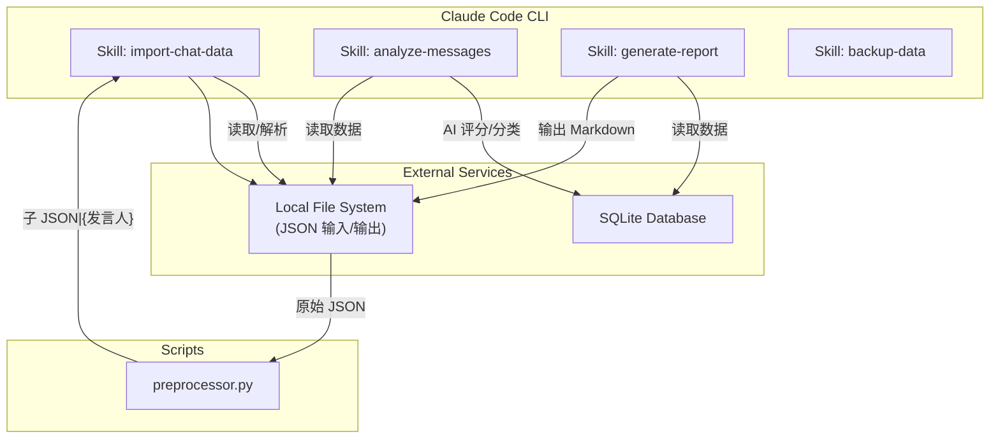
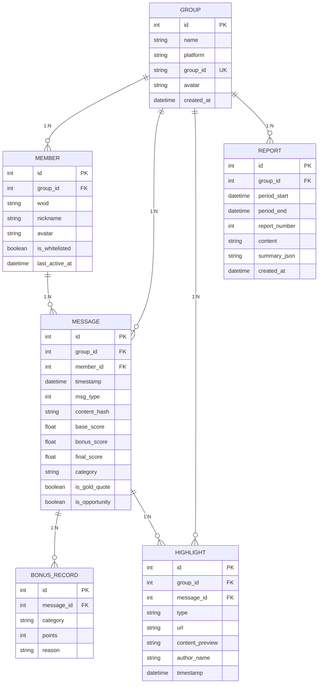
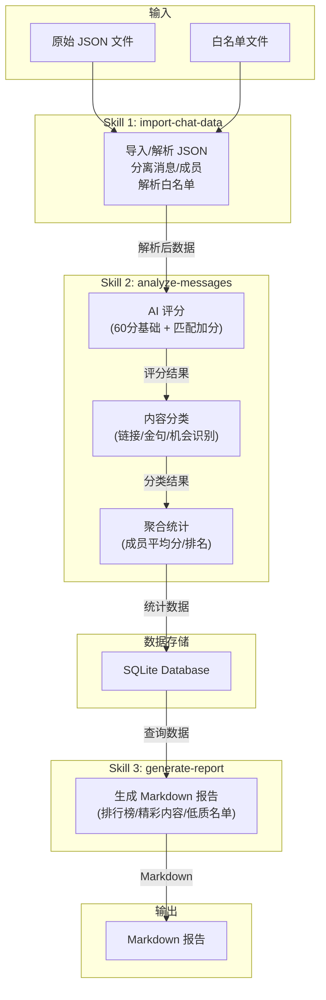

# 系分文档: 群聊记录分析工具 (Agent Skills 方案)

## 关联文档

| 文档 | 路径 |
|------|------|
| PRD | [PRD.md](/docs/产品/PRD/PRD.md) |
| BRD | [BRD_业务需求文档.md](/docs/产品/BRD/BRD_业务需求文档.md) |
| 技术选型 | [技术选型报告.md](/docs/技术选型报告.md) |

---

## 1. 需求理解

### 1.1 核心需求概述

基于 PRD，本工具需要实现以下核心功能：

| 功能模块 | 核心需求 | 优先级 |
|----------|----------|--------|
| 数据采集 | 导入 JSON 格式月度聊天记录，解析成员/消息结构 | P0 |
| AI 评分 | 初始分 60 + AI 匹配加分，4维度评估 | P0 |
| 精彩内容提取 | 链接识别、金句判定、机会分享识别 | P0 |
| 报告生成 | Markdown 文档输出（含排行榜、精彩内容、低质名单） | P0 |
| 辅助决策 | 提醒文本生成、清退名单生成 | P1 |

### 1.2 技术目标

1. **数据处理**：支持 JSON 格式导入，月度消息量级（预估 < 5000 条）
2. **评分效率**：月度消息 AI 评分耗时 < 30秒
3. **评分准确率**：低质成员判定准确率 > 90%
4. **输出格式**：仅生成 Markdown 文档

### 1.3 技术约束

| 约束项 | 说明 |
|--------|------|
| 运行方式 | Claude Code Agent，通过 Skills 调用 |
| AI 模型 | 仅使用 Claude Code 内置模型，不调用外部 API |
| 数据存储 | 数据仅本地处理，不上云 |
| 数据格式 | 仅支持 JSON（来自月度导出） |

### 1.4 白名单机制

**输入格式**：支持简单的文本列表（PRD 要求）

```text
# Top3 活跃成员
张三
李四
王五

# 贡献成员
赵六
钱七
```

**豁免规则**：
- 白名单成员不参与低质判定
- 但参与活跃度排名
- 支持 `#` 注释和空行

### 1.5 低质成员判定逻辑

| 判定类型 | 条件 | 严重程度 |
|----------|------|----------|
| **零发言** | 周期内无任何有效消息 | 高 |
| **低质量** | 平均分 < 60分 | 中 |
| **低频次** | 发言数 < 5条 | 低 |

**排序规则**：按严重程度降序排列（零发言 → 低质量 → 低频次）

---

## 2. Agent Skills 架构设计

### 2.1 整体架构



### 2.2 Skills 定义

#### Skill 1: import-chat-data (数据采集)

**职责**：导入并解析月度群聊记录 JSON 文件

**输入参数**：
```typescript
interface ImportInput {
  filePath: string;      // JSON 文件路径（必需）
  config?: {
    whitelistPath?: string;   // 白名单文件路径（可选）
    startDate?: string;       // 统计开始时间 ISO 8601（可选）
    endDate?: string;         // 统计结束时间 ISO 8601（可选）
  };
}
```

**实现方式**：由 SKILL.md 中的指令处理，包含 JSON 解析逻辑与白名单解析规则

**输出**：
```typescript
interface ImportOutput {
  success: boolean;
  data?: {
    groupInfo: GroupInfo;
    messages: ParsedMessage[];
    members: Member[];
    whitelist: string[];       // 白名单成员昵称列表
    statistics: ImportStatistics;
  };
  error?: {
    code: string;
    message: string;
  };
}

interface ImportStatistics {
  totalMessages: number;
  validMessages: number;
  filteredMessages: number;
  totalMembers: number;
  whitelistedMembers: number;
}
```

---

#### Skill 2: analyze-messages (AI 分析)

**职责**：消息评分、内容分类

**输入参数**：
```typescript
interface AnalyzeInput {
  messages: ParsedMessage[];    // 待评分消息
  whitelist: string[];         // 白名单成员昵称列表
  config?: {
    lowQualityThreshold?: number;   // 低质判定阈值，默认 60
    minMessageCount?: number;        // 低频次阈值，默认 5
  };
}
```

**实现方式**：由 SKILL.md 中的 Prompt 指令处理，包含 AI 评分规则与内容分类逻辑（纯 Claude Code 模型）

**AI 评分 Prompt（匹配加分机制）**：

```markdown
## 角色
你是一个群聊内容质量评估专家，负责对群成员的消息进行评分。

## 评分规则
**初始分**: 60 分（每条消息的起点）

**加分项**（满足条件则加分，可叠加）:

| 加分类别 | 加分分值 | 条件说明 |
|----------|----------|----------|
| 技术分享 | +15~25 | 分享技术文章、教程、代码片段、解决方案 |
| 资源分享 | +10~20 | 分享有价值的工具、链接、资料 |
| 解答问题 | +10~15 | 回答他人问题，提供有效帮助 |
| 深度讨论 | +10~20 | 参与技术讨论，提出独到见解 |
| 原创观点 | +10~15 | 输出个人原创思考或经验总结 |
| 机会分享 | +10~15 | 分享招聘、合作、实习等信息 |
| 互动回复 | +5~10 | 对他人消息进行有价值的回复 |

**扣分项**（直接重置为低分或 0 分）:

| 扣分类别 | 分值 | 条件说明 |
|----------|------|----------|
| 纯表情包 | 0分 | 仅发送表情包，无文字内容 |
| 单字回复 | 0分 | "嗯"、"好"、"1"、"ok" 等无意义回复 |
| 刷屏重复 | 0分 | 短时间内重复发送相同内容 |
| 水群无意义 | 0~20分 | "来了"、"签到"、"打卡" 等无营养内容 |

## 任务
对以下消息进行评分，判断符合哪些加分/扣分条件。

## 输出格式

{
  "base_score": 60,
  "bonus_items": [
    {"category": "技术分享", "points": 20, "reason": "分享了 Vue 3 教程链接"}
  ],
  "deduction_items": [],
  "final_score": 80,
  "is_gold_quote": false,
  "is_opportunity": false,
  "category": "tech_article|github|insight|opportunity|other"
}

## 特殊说明
- 只返回 JSON，不要有其他内容
- 不要调用任何工具
- 加分分值在同一类别内有浮动范围，根据内容质量浮动

**输出**：
interface AnalyzeOutput {
  success: boolean;
  data?: {
    memberScores: MemberScore[];     // 每个成员的评分统计
    highlights: Highlight[];         // 精彩内容列表
    lowQualityMembers: LowQualityMember[];  // 低质成员名单
  };
  error?: {
    code: string;
    message: string;
  };
}

interface MemberScore {
  wxid: string;
  nickname: string;
  messageCount: number;
  totalScore: number;
  averageScore: number;
  isWhitelisted: boolean;
  status: "normal" | "low_quality" | "zero_activity" | "low_frequency";
  reason?: string;  // 低质原因
}

interface LowQualityMember {
  wxid: string;
  nickname: string;
  messageCount: number;
  averageScore: number;
  status: "zero_activity" | "low_quality" | "low_frequency";
  severity: "high" | "medium" | "low";  // 严重程度
}

interface Highlight {
  type: "article" | "github" | "insight" | "opportunity";
  url?: string;
  content?: string;
  author: string;
  timestamp: Date;
}
```

---

#### Skill 3: generate-report (报告生成)

**职责**：生成 Markdown 格式报告

**输入参数**：
```typescript
interface ReportInput {
  groupInfo: GroupInfo;
  memberScores: MemberScore[];
  highlights: Highlight[];
  lowQualityMembers: LowQualityMember[];
  config?: {
    period?: { start: string; end: string; };
    outputPath?: string;   // Markdown 文件路径（可选，不指定则返回内容）
    reportNumber?: number; // 报告期号，默认 1
  };
}
```

**输出**：
```typescript
interface ReportOutput {
  success: boolean;
  data?: {
    content: string;      // Markdown 内容
    filePath?: string;     // 输出文件路径（如果已保存）
    summary: {
      totalMembers: number;
      activeMembers: number;
      lowQualityCount: number;
      highlightsCount: number;
    };
  };
  error?: {
    code: string;
    message: string;
  };
}
```

**实现方式**：由 SKILL.md + template.md 定义报告结构与格式

**Markdown 报告模板**（Jinja2 语法）：

```markdown
# 📊 群聊周期报告 - {{ group_name }}

**统计周期**: {{ period_start }} ~ {{ period_end }}
**生成时间**: {{ generated_at }}
**报告期号**: 第 {{ report_number }} 期

---

## 📈 数据概览

| 指标 | 数值 |
|------|------|
| 总成员数 | {{ total_members }} |
| 活跃成员数 | {{ active_members }} |
| 低质成员数 | {{ low_quality_count }} |
| 精彩内容数 | {{ highlights_count }} |

---

## 🏆 活跃度排行榜 (Top10)

| 排名 | 成员 | 发言数 | 平均分 |
|------|------|--------|--------|

| {{ loop.index }} | {{ member.name }} | {{ member.msg_count }} | {{ "%.1f"|format(member.avg_score) }} |


---

## ✨ 本期精彩内容

### 📚 公众号/技术文章

- [{{ item.title }}]({{ item.url }}) @{{ item.author }}

- 暂无


### 💻 Github 项目

- [{{ item.repo }}]({{ item.url }}) @{{ item.author }}

- 暂无


### 💡 原创见解

- "{{ item.content }}" — @{{ item.author }}

- 暂无


### 🎯 机会分享

- {{ item.summary }} — @{{ item.author }}

- 暂无


---

## ⚠️ 低质成员名单


### {{ loop.index }}. {{ member.name }}
- **发言数**: {{ member.msg_count }}
- **平均分**: {{ "%.1f"|format(member.avg_score) }}
- **原因**: {{ member.reason }}
- **严重程度**: {{ member.severity_emoji }}

---

- 本期无低质成员


## 📝 附录

### 低质判定规则
- **零发言**: 周期内无任何有效消息
- **低质量**: 平均分 < 60 分
- **低频次**: 发言数 < 5 条

---
*报告由群聊分析工具自动生成*
```

---

## 3. 数据模型设计

### 3.1 ER 图



### 3.2 数据库 Schema (SQLite)

```sql
-- 群组信息表
CREATE TABLE groups (
    id INTEGER PRIMARY KEY AUTOINCREMENT,
    name TEXT NOT NULL,
    platform TEXT DEFAULT 'wechat',
    group_id TEXT UNIQUE NOT NULL,
    avatar TEXT,
    created_at DATETIME DEFAULT CURRENT_TIMESTAMP
);

-- 成员信息表
CREATE TABLE members (
    id INTEGER PRIMARY KEY AUTOINCREMENT,
    group_id INTEGER NOT NULL,
    wxid TEXT NOT NULL,
    nickname TEXT NOT NULL,
    avatar TEXT,
    is_whitelisted BOOLEAN DEFAULT 0,
    last_active_at DATETIME,
    FOREIGN KEY (group_id) REFERENCES groups(id),
    UNIQUE(group_id, wxid)
);

-- 消息表（评分后脱敏，只保留统计信息）
CREATE TABLE messages (
    id INTEGER PRIMARY KEY AUTOINCREMENT,
    group_id INTEGER NOT NULL,
    member_id INTEGER NOT NULL,
    timestamp DATETIME NOT NULL,
    msg_type INTEGER DEFAULT 0,
    content_hash TEXT,
    base_score REAL DEFAULT 60,
    bonus_score REAL DEFAULT 0,
    final_score REAL,
    category TEXT,
    is_gold_quote BOOLEAN DEFAULT 0,
    is_opportunity BOOLEAN DEFAULT 0,
    FOREIGN KEY (group_id) REFERENCES groups(id),
    FOREIGN KEY (member_id) REFERENCES members(id)
);

-- 加分记录表
CREATE TABLE bonus_records (
    id INTEGER PRIMARY KEY AUTOINCREMENT,
    message_id INTEGER NOT NULL,
    category TEXT NOT NULL,
    points INTEGER NOT NULL,
    reason TEXT,
    FOREIGN KEY (message_id) REFERENCES messages(id)
);

-- 精彩内容表
CREATE TABLE highlights (
    id INTEGER PRIMARY KEY AUTOINCREMENT,
    group_id INTEGER NOT NULL,
    message_id INTEGER NOT NULL,
    type TEXT NOT NULL,
    url TEXT,
    content_preview TEXT,
    author_name TEXT,
    timestamp DATETIME,
    FOREIGN KEY (group_id) REFERENCES groups(id),
    FOREIGN KEY (message_id) REFERENCES messages(id)
);

-- 报告表
CREATE TABLE reports (
    id INTEGER PRIMARY KEY AUTOINCREMENT,
    group_id INTEGER NOT NULL,
    period_start DATETIME NOT NULL,
    period_end DATETIME NOT NULL,
    report_number INTEGER NOT NULL,
    content TEXT NOT NULL,
    summary_json TEXT NOT NULL,
    created_at DATETIME DEFAULT CURRENT_TIMESTAMP,
    FOREIGN KEY (group_id) REFERENCES groups(id),
    UNIQUE(group_id, period_start, period_end)
);

-- 索引优化
CREATE INDEX idx_messages_group_time ON messages(group_id, timestamp);
CREATE INDEX idx_messages_member ON messages(member_id);
CREATE INDEX idx_members_wxid ON members(wxid);
CREATE INDEX idx_highlights_type ON highlights(type);
CREATE INDEX idx_reports_period ON reports(group_id, period_start, period_end);
```

### 3.3 数据结构定义 (TypeScript)

```typescript
// 群组信息
interface GroupInfo {
  name: string;
  platform: string;
  groupId: string;
  avatar: string;
}

// 成员信息
interface Member {
  id: string;
  wxid: string;
  nickname: string;
  avatar: string;
  isWhitelisted: boolean;
}

// 消息结构（原始）
interface Message {
  _type: "message";
  sender: string;
  accountName: string;
  timestamp: number;
  type: number;
  content: string;
}

// 解析后的消息
interface ParsedMessage {
  id: string;
  wxid: string;
  nickname: string;
  timestamp: Date;
  msgType: number;
  content: string;
  isSystemMessage: boolean;
}

// 评分结果
interface MessageScore {
  messageId: string;
  baseScore: number;
  bonusItems: BonusItem[];
  finalScore: number;
  category: string;
  isGoldQuote: boolean;
  isOpportunity: boolean;
}

// 加分项
interface BonusItem {
  category: string;
  points: number;
  reason: string;
}

// 成员评分统计
interface MemberScore {
  wxid: string;
  nickname: string;
  messageCount: number;
  totalScore: number;
  averageScore: number;
  isWhitelisted: boolean;
  status: "normal" | "low_quality" | "zero_activity" | "low_frequency";
  reason?: string;
}

// 精彩内容
interface Highlight {
  type: "article" | "github" | "insight" | "opportunity";
  url?: string;
  content?: string;
  author: string;
  timestamp: Date;
}

// 低质成员
interface LowQualityMember {
  wxid: string;
  nickname: string;
  messageCount: number;
  averageScore: number;
  status: "zero_activity" | "low_quality" | "low_frequency";
  severity: "high" | "medium" | "low";
  reason: string;
}

// 报告摘要
interface ReportSummary {
  totalMembers: number;
  activeMembers: number;
  lowQualityCount: number;
  highlightsCount: number;
}
```

---

## 4. 项目结构

### 4.1 目录结构

```
WxGroupReport/
├── skills/                      # Skills 目录
│   ├── import-chat-data/       # Skill 1: 数据采集
│   │   ├── SKILL.md           # 必需
│   │   └── template.md        # 可选
│   │
│   ├── analyze-messages/        # Skill 2: AI 分析
│   │   ├── SKILL.md           # 必需
│   │   └── examples/          # 可选
│   │
│   ├── generate-report/        # Skill 3: 报告生成
│   │   ├── SKILL.md           # 必需
│   │   └── template.md        # 必需
│   │
│   └── backup-data/            # Skill 4: 数据存储
│       ├── SKILL.md           # 必需
│       └── scripts/
│           └── storage.py     # 放在 scripts 子目录
│
├── scripts/                     # 脚本目录
│   └── preprocessor.py         # Phase 0: 数据预处理
│
├── data/                       # 数据目录
│   └── .gitkeep
│
├── output/                     # 输出目录
│   └── .gitkeep
│
├── requirements.txt
└── .gitignore
```

### 4.2 依赖文件

**requirements.txt**：
```text
jinja2>=3.1.0          # 模板引擎
python-dotenv>=1.0.0   # 环境变量
pytest>=7.0.0          # 测试框架
```

**.env.example**：
```bash
# 路径配置
DATA_DIR="./data"
```

---

## 5. 核心流程设计

### 5.1 整体处理流程


```

---

## 6. 风险评估与应对

| 风险 | 影响 | 概率 | 应对措施 |
|------|------|------|----------|
| AI 评分不稳定 | 高 | 中 | 1. 使用低 temperature (0.3) <br> 2. 人工抽检 <br> 3. Prompt 持续优化 |
| 模型上下文限制 | 中 | 中 | 1. 消息分批处理 <br> 2. 预处理脚本拆分大 JSON |
| 格式兼容性 | 低 | 低 | 1. 单 JSON 格式，来源固定 |
| 加分规则不清晰 | 中 | 中 | 1. 先按通用规则 <br> 2. 根据实际反馈迭代调整 |
| **SQL 注入** | 高 | 低 | 1. 使用参数化查询 <br> 2. 输入验证与过滤 |
| **Prompt 注入** | 高 | 中 | 1. 输入内容清洗 <br> 2. 系统 Prompt 隔离 <br> 3. 输出结果校验 |

---

## 7. 任务拆分与工作量评估

### 7.1 任务拆分

| 阶段 | 任务 | 实现方式 | 工时 |
|------|------|----------|------|
| **Phase 0: 数据预处理** |
| | 0.1 原始 JSON 清洗 | preprocessor.py | 0.25d |
| | 0.2 按发言人拆分 | preprocessor.py | 0.25d |
| **Phase 1: SKILL 导入** |
| | 1.1 数据导入 | skills/import-chat-data/SKILL.md | 0.25d |
| | 1.2 白名单解析 | skills/import-chat-data/SKILL.md | 0.25d |
| **Phase 2: SKILL AI 评分** |
| | 2.1 评分规则定义 | skills/analyze-messages/SKILL.md | 0.5d |
| | 2.2 Claude Code 模型集成 | SKILL.md Prompt | 0.25d |
| | 2.3 批量评分控制 | preprocessor.py | 0.25d |
| **Phase 3: SKILL 内容分类** |
| | 3.1 链接正则提取 | skills/analyze-messages/SKILL.md | 0.25d |
| | 3.2 金句/机会 AI 判定 | skills/analyze-messages/SKILL.md | 0.5d |
| **Phase 4: 数据存储** |
| | 4.1 SQLite 导入 | skills/backup-data/scripts/storage.py | 0.25d |
| | 4.2 数据查询 | skills/backup-data/scripts/storage.py | 0.25d |
| **Phase 5: SKILL 报告生成** |
| | 5.1 报告结构定义 | skills/generate-report/SKILL.md | 0.25d |
| | 5.2 Markdown 输出 | skills/generate-report/template.md | 0.25d |
| **Phase 6: 测试** |
| | 6.1 上下文限制测试 | 手工测试 | 0.25d |
| | 6.2 集成测试 | 手工测试 | 0.5d |

### 7.2 总工时评估

| 阶段 | 预估工时 |
|------|----------|
| Phase 0 (数据预处理) | 0.5d |
| Phase 1 (SKILL 导入) | 0.5d |
| Phase 2 (SKILL AI 评分) | 1.0d |
| Phase 3 (SKILL 内容分类) | 0.75d |
| Phase 4 (数据存储) | 0.5d |
| Phase 5 (SKILL 报告生成) | 0.5d |
| Phase 6 (测试) | 0.75d |
| **总计** | **4.0d ≈ 4d** |

---

## 8. 后续演进

### 方向一: 加分规则迭代

| 功能 | 说明 |
|------|------|
| 规则优化 | 根据实际使用反馈，调整加分项和分值 |
| 规则可视化 | 输出加分规则说明文档 |

### 方向二: 历史对比分析

| 功能 | 说明 |
|------|------|
| 多周期数据对比 | 跨月份的活跃度、精彩内容对比 |
| 成员成长追踪 | 单个成员的活跃度变化趋势 |

### 方向三: 提醒文本生成

| 功能 | 说明 |
|------|------|
| 自动提醒 | 生成针对低质成员的提醒文本 |
| 批量导出 | 导出为可复制格式 |

### 方向四: 多 Agent 协作

| 功能 | 说明 |
|------|------|
| 数据预处理 Agent | 原始 JSON 清洗、拆分、标准化 |
| 评分 Agent | 专注消息质量评分 |
| 分类 Agent | 专注内容分类（技术文章/Github/机会等） |
| 报告 Agent | 专注报告生成与格式化 |

---

**创建人**: Kyle
**创建日期**: 2026-02-05
**版本**: v3.0
